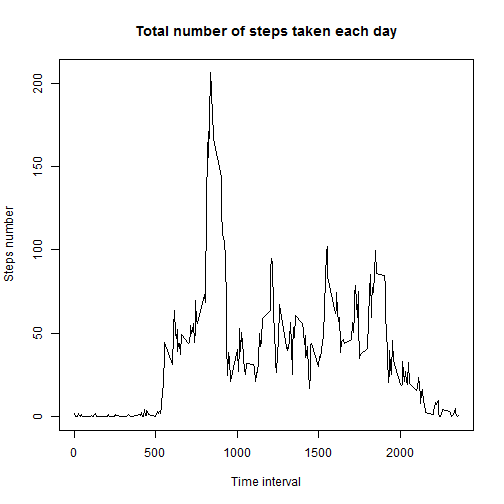

## Loading and preprocessing the data


```r
## download and load the dataset to act
setwd('C:/Courses/coursera/05 Reproducible research/assignment')
filename <- "Activity monitoring data.zip"
if (!file.exists(filename)){
        fileURL <- "https://d396qusza40orc.cloudfront.net/repdata%2Fdata%2Factivity.zip "
        download.file(fileURL, filename, mode = 'wb')
}  
if (!file.exists("Activity monitoring data")) { 
        unzip(filename) 
}
act <- read.csv('activity.csv')
```

## Q1: What is mean total number of steps taken per day?

Calculate the total number of steps taken per day

```r
TotalStepByDay <- with(act, tapply(steps, date, sum, na.rm = TRUE))
```

Make a histogram of the total number of steps taken each day

```r
hist(TotalStepByDay, breaks = 10, xlab = 'Steps number', 
     main = 'Total number of steps taken each day')
```


Calculate the mean of the total number of steps taken per day

```r
mean(TotalStepByDay)
```

```
## [1] 9354.23
```

Calculate the median of the total number of steps taken per day

```r
median(TotalStepByDay)
```

```
## [1] 10395
```

## Q2: What is the average daily activity pattern?

Calculate the average activity based on every 5min interval

```r
MeanStepByTime <- with(act, tapply(steps, interval, mean, na.rm = TRUE))
```

Make a time series plot (i.e. type = "l") of the 5-minute interval (x-axis) and the average number of steps taken, averaged across all days (y-axis)

```r
plot(names(MeanStepByTime), MeanStepByTime, type = 'l', ylab = 'Steps number', xlab = 'Time interval', 
     main = 'Total number of steps taken each day')
```



Which 5-minute interval, on average across all the days in the dataset, contains the maximum number of steps?

```r
names(which.max(MeanStepByTime))
```

```
## [1] "835"
```

## Q3: Imputing missing values

Calculate the total number of missing values in the dataset

```r
sum(is.na(act))
```

```
## [1] 2304
```

Fill in all of the missing values in the dataset by the mean for that 5-minute interval

```r
act[is.na(act), 1] <- MeanStepByTime[as.character(act[is.na(act),3])]
```

Make a histogram of the total number of steps taken each day 

```r
TotalStepByDay2 <- with(act, tapply(steps, date, sum))
hist(TotalStepByDay2, breaks = 10, xlab = 'Steps number', 
     main = 'Total number of steps taken each day without missing values')
```


Calculate the mean total number of steps taken per day. 

```r
mean(TotalStepByDay2)
```

```
## [1] 10766.19
```

Calculate the median total number of steps taken per day. 

```r
median(TotalStepByDay2)
```

```
## [1] 10766.19
```

The mean and median after filling in missing value increased.

## Q4: Are there differences in activity patterns between weekdays and weekends?

Create a new factor variable in the dataset with two levels - "weekday" and "weekend" indicating whether a given date is a weekday or weekend day.

```r
week <- weekdays(as.Date(act$date, '%Y-%m-%d'))
weekend <- c('Saturday', 'Sunday')
act$date <- factor((week %in% weekend), labels = c('weekday', 'weekend'))
```

Make a panel plot containing a time series plot (i.e. type = "l") of the 5-minute interval (x-axis) and the average number of steps taken, averaged across all weekday days or weekend days (y-axis).

```r
library(lattice)
StepsByWeek <- with(act, aggregate(steps, by = list(interval, date), FUN = mean))
xyplot(x ~ Group.1 | Group.2, StepsByWeek, type = 'l', ylab = 'Steps number', xlab = 'Time interval', 
     main = 'Total number of steps taken on weekday and weekend', 
     layout = c(2, 1))
```


